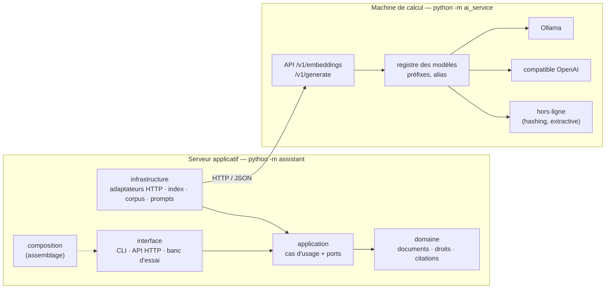

# Assistant documentaire RAG — fil rouge du cours FYC

**Concevoir une application IA maintenable avec la Clean Architecture : jusqu'où peut-on isoler le modèle ?**

Un assistant qui répond aux questions des salariés à partir de documents internes, en citant ses sources et en respectant les droits d'accès. L'application et l'IA sont **deux programmes distincts qui communiquent en HTTP**, comme en entreprise : les machines puissantes hébergent les modèles, les serveurs applicatifs hébergent l'application.

- Python 3.11 ou plus, **aucune dépendance à installer** pour le cœur du projet.
- Mode hors-ligne intégré : tout fonctionne sans modèle ni GPU, pour les tests et le développement.
- Vrais modèles via [Ollama](https://ollama.com) (ou tout serveur compatible OpenAI : LM Studio, llama.cpp, vLLM).

**Vous suivez le cours ? Par où commencer :**

1. `docs/installation.md` — Python, Git, puis Ollama quand vous en aurez besoin (15 min hors-ligne).
2. Le démarrage rapide ci-dessous : deux terminaux, une question, une réponse citée.
3. La carte « Où la problématique apparaît dans le code », en bas de cette page : chaque séquence
   du cours pointe vers les fichiers qui la portent.
4. `exercices/` et `cas-pratique/` : les points de départ, les énoncés, les corrigés.
5. `docs/adr/` : pourquoi chaque frontière est là — et ce qu'on a écarté.

## Architecture



Les flèches pleines de l'application pointent vers l'intérieur : c'est la règle de dépendance, **vérifiée par un test** (`tests/architecture/`).
Ce test lit les imports et les noms qu'ils lient : il attrape les erreurs, pas la malveillance. Il ne suit ni un
import dynamique (`importlib`, `__import__`), ni l'introspection (`build.__globals__`), ni une écriture dynamique
(`globals()`, `setattr`) sur un nom déjà défini, ni ce que font les appels, ni le corps des fonctions de la racine
de composition (seule leur signature est lue), ni la portée des noms (un paramètre homonyme d'un module importé
compte comme ce module) : le détail est dans sa docstring.

```
assistant/                  application (serveur applicatif)
  domain/                   entités, droits d'accès, vérification des citations et de la forme des réponses
  application/              cas d'usage IndexCorpus, SearchPassages, AskQuestion, CheckStatus, RecordSnapshot ; ports ; décorateur de validation (guards.py)
  infrastructure/           adaptateurs : HTTP vers le service IA, index JSON, corpus Markdown, prompts, instantanés, horloge ; décorateurs techniques (cache, journal, tentatives)
  interface/                CLI, API HTTP, banc d'essai
  composition.py            racine de composition (seul endroit qui connaît tout)
  prompts/answer.toml       prompt versionné (answer-v2.toml : la variante de la séquence 3.3)
ai_service/                 service IA (déployable séparément, ne partage aucun code)
  backends/                 ollama, openai_compatible, sentence_transformers, hashing, extractive
  registry.py               alias → moteur + particularités du modèle
config/                     app.toml (hors-ligne, corpus Solvéo) · app-ollama.toml (vrais modèles, corpus réel) · ai_service.toml (modèles servis)
corpus/solveo/              9 documents fictifs (tests, démarrage hors-ligne)
corpus/service-public/      322 fiches réelles Service-Public.gouv.fr (DILA, Licence Ouverte 2.0), voir corpus/README.md
tools/import_service_public.py  reconstruit ce corpus depuis l'archive XML de la DILA
tools/experiences/          cinq expériences reproductibles (découpage, embeddings, générateur, prompt, stabilité)
eval/questions*.json        questions d'évaluation : Solvéo ; Service-Public (calibration) ; Service-Public (validation)
docs/installation.md        guide pas à pas Windows / macOS / Linux, durées mesurées, pannes courantes
docs/contrat-http.md        contrat entre les deux programmes
docs/artefacts.md           les sept artefacts à versionner ensemble, et ce que le code détecte
docs/adr/                   neuf décisions d'architecture, avec ce qui a été écarté
exercices/                  exercices de code : kits de départ, énoncés, corrigés (S2.2, S3.1, S4.1)
cas-pratique/               S5.1 : une version mal structurée du fil rouge à rendre maintenable, énoncé, grille, corrigé
tests/                      401 tests, bibliothèque standard uniquement
```

## Démarrage rapide (hors-ligne, sans modèle)

Première installation (Python, Git, Ollama, modèles) : `docs/installation.md`.

Toutes les commandes se lancent depuis la racine du projet. Sous Windows, remplacer `python` par `py` si nécessaire.

**Terminal 1 — le service IA :**

```bash
python -m ai_service
```

**Terminal 2 — l'application :**

```bash
python -m assistant index
python -m assistant ask "Combien de jours de télétravail par semaine ?"
python -m assistant ask "Quelle est la fourchette de salaire d'un consultant senior ?" --user alice   # la grille (RH) est filtrée avant le prompt : réponse tirée d'une fiche publique, voir -v
python -m assistant ask "Quelle est la fourchette de salaire d'un consultant senior ?" --user bruno   # autorisé
python -m assistant ask "Quelle est la capitale de l'Australie ?" -v                                 # hors corpus, trace détaillée
```

La commande vient d'abord, puis ses options, lues par `argparse` : une option inconnue, abrégée (`--us` pour
`--user`), d'une autre commande ou placée avant la commande, et un argument en trop, sont refusés, jamais ignorés
(« option(s) ou argument(s) non reconnu(s) » ; `python -m assistant <commande> -h` donne ce que la commande accepte).
`--` termine les options : ce qui suit est un argument (`ask -- "-vingt degrés ?"` : sans `--`, cette question qui
commence par `-v` serait prise pour une option). Un nombre négatif est une valeur (`--limit -1`, refusé ensuite :
au moins 1). Codes de retour :
0 ok · 1 erreur, saisie comprise · `status` : 2 à refaire, 3 non vérifié · `index --if-stale` : 3 non vérifié.
Sans `--config`, la configuration est celle de la variable d'environnement `ASSISTANT_CONFIG`, sinon
`config/app.toml` ; `--config`, `--embedding-model`, `--generation-model` ou `--prompt` donnés vides (`""`) valent
la configuration, et `--out ""` le dossier daté, comme absents. `ASSISTANT_LOG` donne le
niveau du journal, un nom de niveau de `logging` sans tenir compte de la casse (`DEBUG`, `INFO`, `WARNING`, `ERROR`,
`CRITICAL`…) : avec `INFO` (ou `DEBUG`), il affiche le journal des décorateurs, comme `-v` ; toute autre valeur vaut
`WARNING`. La variable vaut aussi pour le banc, mais les scripts de `tools/experiences/` l'ignorent.

La configuration (`config/*.toml`) est en UTF-8 (une marque d'ordre des octets est acceptée) : un fichier
enregistré dans un autre encodage est refusé, avec le fichier, l'octet fautif et sa position. Un entier démesuré
(plus de 4300 chiffres, que `int()` ne sait pas convertir ; en hexadécimal, en octal ou en binaire, à partir de
10^4300) est refusé à la lecture, avec un message en français : « TOML invalide — nombre entier de plus de 4300
chiffres », comme pour une erreur de syntaxe.

**Les deux verdicts de la problématique, en deux commandes :**

```bash
# Changer le modèle de génération : aucun problème, même index
python -m assistant ask "Combien de jours de congés ?" --generation-model extractive-bruite -v

# Changer le modèle d'embeddings : refus explicite, il faut réindexer
python -m assistant ask "Combien de jours de congés ?" --embedding-model hashing-512
```

**API HTTP de l'application :**

```bash
python -m assistant serve                    # port 8000 ; --port 0 : un port libre, affiché au démarrage
curl -X POST http://127.0.0.1:8000/v1/ask -H "Content-Type: application/json" \
     -d '{"user": "alice", "question": "Quel est le plafond pour un repas le midi ?"}'
curl -i http://127.0.0.1:8000/v1/status      # 200 à jour · 409 à refaire · 503 non vérifié
```

`GET /v1/status` rend le rapport de `status` (`up_to_date`, `unverified`, `issues`…), et non `{"error": …}`, avec 200
(à jour), 409 (à refaire) ou 503 (non vérifié : le service IA a échoué). Ses autres codes sont ceux du tableau
ci-dessous (500 pour un index illisible, par exemple).

Erreurs, en JSON (`{"error": {"code": …, "message": …}}`) :

| HTTP | `code` | Cause |
|---|---|---|
| 400 | `invalid_json` | corps qui n'est pas un objet JSON strict en UTF-8 : octets qui ne sont pas de l'UTF-8, clé en double, chaîne avec un surrogate UTF-16 isolé, `NaN` ou `Infinity`, entier de plus de 4300 chiffres, plus de 900 niveaux d'imbrication |
| 400 | `invalid_request` | `user` ou `question` présent mais pas une chaîne (absent ou `null`, il vaut `""` : 403 `unknown_user` pour `user`, 400 `invalid_question` pour `question`) ; `Content-Length` illisible, ou deux `Content-Length` différents (répété à l'identique, il est fondu en un) ; envoi en morceaux (`Transfer-Encoding`) : envoyer `Content-Length` à la place ; ligne de requête illisible ou version HTTP mal écrite (`HTTP/abc`) ; corps plus court que son `Content-Length` (le client a fermé son envoi avant la fin : vu à tout moment pour un corps lu ; pour un corps jeté, s'il est déjà fermé dans ce qui en est arrivé, 64 Kio au plus, au-delà desquels la réponse est celle du corps jeté : 404, 405 ou 413) |
| 400 | `invalid_question` | question vide |
| 403 | `unknown_user` | utilisateur absent de la configuration |
| 404 | `not_found` | route inconnue, quelle que soit la méthode |
| 405 | `method_not_allowed` | route connue, autre méthode : l'en-tête `Allow` donne celles permises (`GET, HEAD` pour `/health` et `/v1/status`, `POST` pour `/v1/index` et `/v1/ask`) ; HEAD est accepté partout où GET l'est (mêmes statut et en-têtes, sans corps) |
| 409 | `index_unusable` | aucun index, index construit avec un autre modèle d'embeddings, ou remplacé pendant la question deux fois de suite (« Reposez la question ») |
| 413 | `payload_too_large` | corps de plus de 16 Mio (16 777 216 octets) sur `/v1/index` ou `/v1/ask` : refusé sans être lu |
| 414, 431, 505 | `invalid_request` | requête refusée avant d'être lue : ligne de requête trop longue, en-têtes trop longs ou trop nombreux, version HTTP non prise en charge |
| 500 | `unreadable_state` | corpus mal formé ou vide, prompt ou index illisible |
| 500 | `index_write_failed` | index impossible à écrire (l'index en service reste alors le précédent) |
| 500 | `internal_error` | erreur imprévue |
| 502 | `ai_service_error` | service IA injoignable, en erreur, ou réponse hors contrat |

L'application répond en HTTP/1.0 (une connexion par requête, fermée après la réponse) ; un envoi en morceaux
(`Transfer-Encoding`) reçoit 400 : envoyer `Content-Length`. Un client qui n'envoie plus rien pendant 30 s au
milieu d'une requête est abandonné sans réponse.

**L'index est-il encore valable ? Qu'est-ce qui a bougé ?**

```bash
python -m assistant status                                  # corpus, découpage, modèle servi : cohérents avec l'index ?
python -m assistant index --if-stale                        # réindexe seulement si status dit « à refaire »
python -m assistant snapshot record reference --limit 8     # figer le comportement sur les questions d'évaluation
python -m assistant snapshot record bruite --limit 8 --generation-model extractive-bruite
python -m assistant snapshot compare reference bruite       # différences de configuration + taux de dérive
```

`status` rend 2 quand il faut réindexer (corpus ou découpage modifiés, autre modèle servi), 3 quand seul le modèle servi reste à vérifier, le service IA n'ayant pas pu être interrogé (« non vérifié »). La comparaison
d'instantanés liste toujours les différences de configuration à côté de la dérive : 60 % de dérive avec un
changement de générateur est attendu ; 60 % sans aucune différence de configuration est une alerte. Détail
des artefacts et de ce que le code détecte : `docs/artefacts.md`.

## Avec de vrais modèles (Ollama)

1. Installer Ollama : <https://ollama.com/download> (Windows, macOS, Linux).
2. Télécharger au moins un modèle d'embeddings et un modèle de génération. Les noms sont à vérifier sur <https://ollama.com/library> :

   ```bash
   ollama pull bge-m3              # embeddings par défaut, 1,2 Go
   ollama pull llama3.2:3b         # génération par défaut, 2,0 Go
   ollama pull nomic-embed-text    # embeddings « de rupture », 274 Mo
   ollama pull qwen3:4b            # génération « de rupture », 2,5 Go (séquences 3.3 et 4.1)
   ```

3. Relancer le service IA (`python -m ai_service`), puis utiliser la configuration « cours »
   (`config/app-ollama.toml` : `bge-m3` + `llama3-2-3b`, corpus réel de 322 fiches Service-Public) :

   ```bash
   python -m assistant index --config config/app-ollama.toml
   python -m assistant ask "Combien de jours dure le congé de paternité ?" --config config/app-ollama.toml -v
   python -m assistant ask "Quel délai laisser après un abandon de poste ?" --user alice --config config/app-ollama.toml   # fiche RH filtrée : réponse tirée d'une fiche publique
   python -m assistant ask "Quel délai laisser après un abandon de poste ?" --user bruno --config config/app-ollama.toml   # autorisé
   ```

   `--embedding-model` et `--generation-model` surchargent les alias ; `config/app.toml` reste la configuration hors-ligne.

   **Modèles retenus pour le cours** (mesurés le 11/09/2026 sur RTX 3070 8 Go, `eval/resultats/`) :
   `bge-m3` + `llama3.2:3b` — hit@1 0,97 sur le corpus réel, réponse citée en ~1,7 s. Modèles de rupture :
   `nomic-embed-text` (moins bon en français : 0,78 ; en changer force la réindexation) et `qwen3:4b`
   (même index, mode réflexion, latence ×20 à ×30).

### Quels modèles pour quelle machine ?

Ordres de grandeur, à confirmer avec le banc d'essai sur vos machines.

| Machine | Embeddings | Génération | Temps de réponse attendu |
|---|---|---|---|
| 8 Go de RAM, sans GPU | `all-minilm`, `nomic` | `gemma3-1b`, `qwen3-1b7` | quelques secondes à ~20 s |
| 16 Go de RAM, sans GPU | `nomic`, `mxbai`, `bge-m3` | `llama3-2-3b`, `qwen3-4b`, `gemma3-4b` | ~10 à 40 s |
| GPU de 6 Go et plus | tous | `mistral-7b` et au-delà | quelques secondes |

Les alias disponibles et leur description sont dans `config/ai_service.toml` (ou `GET http://127.0.0.1:8100/v1/models`). Ajouter un modèle = ajouter un bloc dans ce fichier, sans toucher au code.

Les modèles `st-*` (sentence-transformers) sont optionnels : `pip install -r requirements-ai-optional.txt` sur la machine du service IA.

## Comparer les modèles : le banc d'essai

```bash
python -m assistant benchmark \
    --embedding hashing all-minilm nomic bge-m3 \
    --generation extractive qwen3-1b7 llama3-2-3b \
    --runs 3
```

Pour chaque modèle d'embeddings, le banc réindexe le corpus, mesure la recherche seule (hit@1, hit@k), puis **propose un seuil de pertinence propre au modèle**. Pour chaque modèle de génération, il pose les 24 questions `--runs` fois et mesure : taux de réponse, bonne source, mots-clés, réponses non sourcées, refus justes (questions sans réponse dans un document accessible : hors corpus ou accès refusé), fuites d'accès (toujours 0), stabilité d'un passage à l'autre, latence.

Sorties dans `eval/resultats/<AAAAMMJJ-HHMMSS>/` (sous la racine du projet quel que soit le dossier courant ; le chemin affiché est complet ; si ce dossier existe déjà, par exemple pour deux bancs lancés dans la même seconde, le nom reçoit `-2`, `-3`…) : `rapport.md` (synthèse lisible), `resultats.csv` (chaque réponse), `synthese.json`, et les index construits.

Sur le corpus réel : `--config config/app-ollama.toml --questions eval/questions-service-public.json`
(42 questions de calibration), puis `--questions eval/questions-service-public-validation.json` (16 questions
jamais vues) pour vérifier que le seuil tient.

Un jeu de questions (banc, expériences, `snapshot record`) est lu strictement : seules les clés `id`, `user`,
`question`, `answerable`, `expected_documents`, `forbidden_documents` et `expected_keywords` sont permises,
plus celles qui commencent par `_` : des commentaires, sans effet (JSON n'en a pas d'autres). `answerable` vaut
`true` ou `false`, chaque identifiant est unique. Le fichier est en UTF-8 (une
marque d'ordre des octets est acceptée ; un fichier en latin-1 est refusé avec l'octet fautif et sa position)
et en JSON strict : une clé en double, `NaN` ou `Infinity`, un entier de plus de 4300 chiffres, plus de 900 niveaux
d'imbrication, une chaîne qui n'est pas du texte (un `\ud800` isolé, même dans un commentaire) sont refusés. Une
erreur nomme le fichier et ce qui est en faute : la question (son numéro) et, s'il y a lieu, le champ ; pour un
défaut du JSON lui-même, repéré dès sa lecture, seulement ce défaut (et la clé, pour une clé en double).

**Durée :** ordre de grandeur, non mesuré — avec un modèle de génération sur CPU à ~10 s par réponse, 24 questions × 3 passages × 2 modèles ≈ 25 minutes ; mesuré sur GPU : 4 min pour `llama3.2:3b`, 1 h pour `qwen3:4b` sur le corpus réel. Commencer par `--runs 1 --limit 8` pour vérifier que tout tourne.

Options utiles :

| Option | Usage |
|---|---|
| `--min-score auto` | utilise le seuil suggéré au lieu de celui de `app.toml` (optimiste : calibré sur les mêmes questions) |
| `--min-score 0.6` | impose un seuil (un nombre de [-1, 1], comme dans `app.toml`) |
| `--max-chars 300 --overlap-chars 50` | change le découpage : l'expérience CACE de la séquence 3.2 |
| `--seed 42` | fixe la graine de génération pour réduire la variabilité |
| `--limit 8` | ne garde que les 8 premières questions (au moins 1) |
| `--prompt answer-v2` | le prompt des réponses, à la place de celui de la configuration |

Exemple mesuré en mode hors-ligne : passer de morceaux de 800 à 300 caractères, sans rien changer d'autre, fait tomber le taux de refus justes (sur les 5 questions sans réponse accessible : 3 hors corpus, 2 d'accès refusé) de 0,80 à 0,40. Tous les scores montent, et le seuil calibré pour l'ancien découpage ne tient plus.

## Expériences reproductibles : changer une chose, mesurer la dérive

Chaque script de `tools/experiences/` change **une seule chose**, enregistre un instantané avant et
après, et écrit un rapport Markdown dans `eval/resultats/exp-<nom>-<AAAAMMJJ-HHMMSS>/` (sous la racine du
projet ; le chemin affiché est complet ; `-2`, `-3`… si ce dossier existe déjà) :

| Script | Ce qui change | Séquence |
|---|---|---|
| `cace_decoupage.py --max-chars 300 --overlap-chars 50` | la taille des morceaux (rien d'autre) | 3.2 |
| `changement_embeddings.py --other nomic` | le modèle d'embeddings : refus sans réindexation, puis réindexation et dérive | 2.3, 3.2 |
| `changement_generateur.py --other qwen3-4b` | le modèle de génération, à index constant | 2.3, 3.3 |
| `prompt_v2.py` | le prompt (`answer` → `answer-v2`), à index et modèles constants | 3.3 |
| `stabilite.py --runs 3 [--seed 42]` | rien : la dérive mesurée est le non-déterminisme | 3.1 |

```bash
python tools/experiences/cace_decoupage.py --config config/app-ollama.toml --questions eval/questions-service-public.json
```

Sans `--config`, les scripts lisent, comme `python -m assistant`, la configuration de `ASSISTANT_CONFIG`, sinon
`config/app.toml` (sous la racine du projet), et le rapport nomme le fichier lu : tel que la variable le donne, ou
en chemin complet.

Un modèle d'embeddings sans seuil configuré reçoit la valeur `default` : l'expérience le signale en
console et dans son rapport (ADR 0004). Pour `changement_embeddings.py` et `changement_generateur.py`, l'alias
`--other` est vérifié auprès du service IA (GET /v1/models : servi, et du bon type ; une réponse hors contrat
est refusée : octets qui ne sont pas de l'UTF-8 (une marque d'ordre des octets est acceptée), alias non textuel,
ou JSON qui n'est pas strict — clé en double, même là où rien n'est lu, `NaN`, entier de plus de 4300 chiffres,
plus de 900 niveaux, chaîne qui n'est pas du texte) avant tout index.

Les rapports de référence (mesurés le 11/09/2026) sont conservés dans `eval/resultats/`. Le banc d'essai
accepte aussi `--validate-with eval/questions-service-public-validation.json` : le seuil retenu est éprouvé
sur des questions qu'il n'a pas vues.

## Déploiement sur deux machines

Sur la machine de calcul, dans `config/ai_service.toml` : `host = "0.0.0.0"`, puis `python -m ai_service`, qui
annonce « Service IA sur http://127.0.0.1:8100, à l'écoute sur toutes les interfaces ».

Sur le serveur applicatif : `base_url` dans `config/app.toml` (clé obligatoire), que la variable
d'environnement `AI_SERVICE_URL` remplace :

```bash
AI_SERVICE_URL=http://machine-gpu:8100 python -m assistant serve --host 0.0.0.0
```

L'application répond alors sur `http://<serveur>:8000`, et `serve` annonce « Application sur http://127.0.0.1:8000,
à l'écoute sur toutes les interfaces » : dans les deux annonces, 0.0.0.0 n'est pas une adresse où se connecter,
127.0.0.1 l'est depuis la machine elle-même.

⚠️ Ni le service IA ni l'application n'ont d'**authentification** : ils sont prévus pour un réseau interne.
L'application croit l'utilisateur que déclare l'appelant (`"user": "alice"`) : les droits d'accès ne protègent
donc que si un proxy authentifié fixe ce champ. En production, placer les deux derrière un tel proxy.

## Points de départ pour les apprenants

- `exercices/s2.2-coeur-metier/depart/` : kit autonome, à copier où l'on veut.
- Branche `s4.1-depart` (à venir : pas encore créée) : le dépôt sans le décorateur de validation, ses tests
  fournis (`git switch s4.1-depart`).
- `cas-pratique/depart/` : l'application à refondre.
- Étiquette `fil-rouge-2026-09-11` (à venir : pas encore posée) : l'état de référence du fil rouge à la fin de sa réalisation ; les étiquettes par séquence (`sX.Y-depart` / `sX.Y-solution`) seront posées avec le découpage définitif du cours.

## Tests

```bash
python -m unittest discover -s tests -t .
```

| Dossier | Ce qui est vérifié |
|---|---|
| `tests/unit/` | domaine et cas d'usage **sans IA, sans réseau** ; adaptateurs ; un exemple de **test statistique** |
| `tests/contract/` | ce que l'application envoie au service IA et ce qu'elle attend en retour |
| `tests/architecture/` | la règle de dépendance, par analyse des imports et des noms (la racine de composition ne prête rien qui touche à l'infrastructure) |
| `tests/ai_service/` | backends (contre de faux serveurs Ollama et OpenAI, y compris des réponses coupées ou mal formées), registre, validation HTTP (JSON strict, 404/405, HEAD, 413 au-delà de 16 Mio, `Content-Length` obligatoire, fondu en un s'il est répété à l'identique, lu en temps linéaire, corps jeté lu après la réponse, délai d'inactivité, délai dépassé ou coupure chez un moteur, même au milieu d'une réponse d'erreur (502 réessayable), port déjà pris, dans le serveur comme au lancement (message clair, code 1)), délai court de `/api/tags`, lancement avec `--port 0` |
| `tests/integration/` | bout en bout en HTTP réel, en mode hors-ligne, dont les deux verdicts |
| `tests/tools/` | l'outil d'import du corpus Service-Public (`tools/import_service_public.py`) : une fiche XML devient un document du corpus |
| `tests/documentation/` | chaque nom de test que cite la documentation (README, `docs/`, `exercices/`…) existe dans le code, et ce tableau nomme chaque dossier de `tests/` |

## Où la problématique apparaît dans le code

| Séquence | Dans le code |
|---|---|
| 1.3 / 2.3 — le modèle derrière un port | `application/ports.py` (`Embedder`, `Generator`) · `infrastructure/http_ai_client.py` |
| 2.2 — un cœur testable sans IA | `tests/unit/test_ask_question.py` · `tests/architecture/test_dependency_rule.py` · kit `exercices/s2.2-coeur-metier/` |
| 2.3 — substituer le générateur | `--generation-model` : même index, rien d'autre à changer |
| 3.1 — non-déterminisme et testabilité | vérification déterministe des citations (`domain/citations.py`) autour d'un appel probabiliste · nouvelles tentatives · `tests/unit/test_statistical_evaluation.py` · générateur `extractive-bruite` · métrique de stabilité du banc · instantanés (`snapshot record/compare`) · `tools/experiences/stabilite.py` · `--validate-with` du banc · exercice `exercices/s3.1-evaluation-statistique/` |
| 3.2 — les données sont du code (CACE) | `IndexModelMismatchError` · découpage enregistré dans le manifeste · seuil de pertinence **par modèle et par corpus** · `tools/experiences/cace_decoupage.py` et `changement_embeddings.py` · ADR 0004 |
| 3.3 — le prompt : configuration ou métier ? | `prompts/answer.toml` et `answer-v2.toml` : construits par l'application, versionnés, tracés dans chaque réponse · `tools/experiences/prompt_v2.py` et `changement_generateur.py` · ADR 0005 |
| 4.1 — isoler l'incertitude | les droits d'accès filtrent **avant** le modèle ; les préfixes propres aux modèles sont gérés dans `ai_service/registry.py` ; les balises `<think>` retirées par `ai_service/registry.py` pour tous les moteurs, le budget de réflexion dans `backends/ollama.py` ; **décorateurs** empilés par `composition.decorate()` : `infrastructure/decorators.py` (cache, journal, tentatives) et `application/guards.py` (validation de la forme : `domain/output_rules.py`) ; exercice `exercices/s4.1-decorateur-de-validation/` (branche `s4.1-depart`) ; ADR 0008 |
| 4.2 — versionner ensemble | `IndexManifest` (empreinte du corpus, découpage, modèle concret) · `AnswerTrace` (index, modèles, version du prompt, passages et scores) · `status` (`application/status.py`) · instantanés et dérive (`application/snapshots.py`) · port `Clock` · `docs/artefacts.md` |
| 4.3 — les limites | index JSON à recherche exhaustive : ≈ 0,1 s pour 3 505 morceaux (93 ms mesurés sans modèle), inutile de sortir une base vectorielle ; ADR 0007 |
| 5.1 / 5.2 — le cas pratique | `cas-pratique/depart/assistant_rag.py` (version mal structurée, fonctionnelle), énoncé, grille sur 20, tableau défaut → correction |

## Limites connues

- Les mesures (`eval/resultats/`) viennent d'une seule machine, avec carte graphique ; les temps sur processeur seul ne sont pas mesurés. Le backend compatible OpenAI n'a été testé que contre un serveur simulé.
- Seuls `nomic` et `bge-m3` ont des seuils calibrés (Solvéo et Service-Public) ; `all-minilm`, `mxbai`, `st-*` gardent des valeurs de départ.
- Le générateur hors-ligne `extractive` connaît le format des passages du prompt : couplage volontaire d'un double de test.
- La validation de la forme des réponses (`domain/output_rules.py`) est une heuristique : marqueurs de raisonnement, ratio de mots anglais. Elle attrape les cas rencontrés le 11/09 (qwen3), pas tous les cas possibles.
- Utilisateurs déclarés dans la configuration ; pas d'authentification.
- Index en fichier JSON, recherche exhaustive : volontairement simple.
