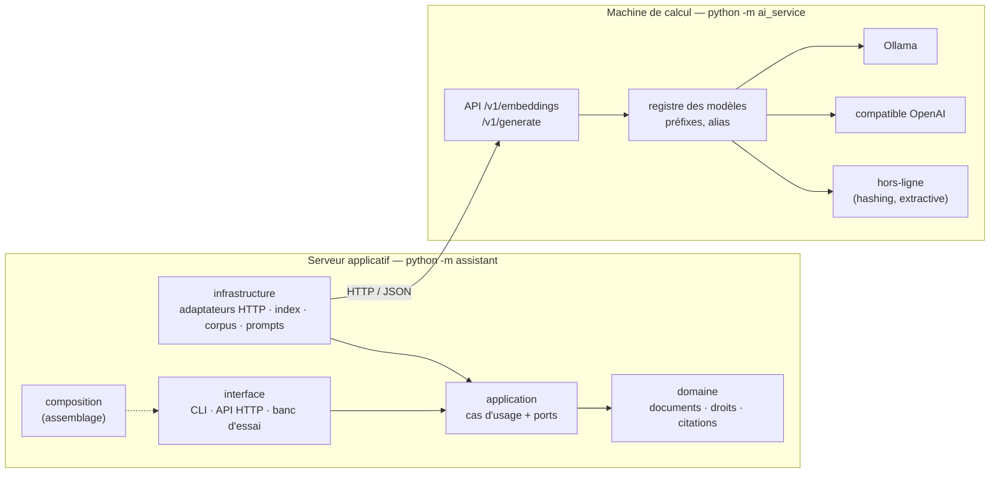

# Assistant documentaire RAG — fil rouge du cours FYC

**Concevoir une application IA maintenable avec la Clean Architecture : jusqu'où peut-on isoler le modèle ?**

Un assistant qui répond aux questions des salariés à partir de documents internes, en citant ses sources et en respectant les droits d'accès. L'application et l'IA sont **deux programmes distincts qui communiquent en HTTP**, comme en entreprise : les machines puissantes hébergent les modèles, les serveurs applicatifs hébergent l'application.

- Python 3.11 ou plus, **aucune dépendance à installer** pour le cœur du projet.
- Mode hors-ligne intégré : tout fonctionne sans modèle ni GPU, pour les tests et le développement.
- Vrais modèles via [Ollama](https://ollama.com) (ou tout serveur compatible OpenAI : LM Studio, llama.cpp, vLLM).

## Architecture



Les flèches pleines de l'application pointent vers l'intérieur : c'est la règle de dépendance, **vérifiée par un test** (`tests/architecture/`).

```
assistant/                  application (serveur applicatif)
  domain/                   entités, droits d'accès, vérification des citations et de la forme des réponses
  application/              cas d'usage IndexCorpus, AskQuestion, CheckStatus, RecordSnapshot ; ports ; décorateur de validation (guards.py)
  infrastructure/           adaptateurs : HTTP vers le service IA, index JSON, corpus Markdown, prompts, instantanés, horloge ; décorateurs techniques (cache, journal, tentatives)
  interface/                CLI, API HTTP, banc d'essai
  composition.py            racine de composition (seul endroit qui connaît tout)
  prompts/answer.toml       prompt versionné (answer-v2.toml : la variante de la séquence 3.3)
ai_service/                 service IA (déployable séparément, ne partage aucun code)
  backends/                 ollama, openai_compatible, sentence_transformers, hashing, extractive
  registry.py               alias → moteur + particularités du modèle
config/                     app.toml (hors-ligne, corpus Solvéo) · app-ollama.toml (vrais modèles, corpus réel) · ai_service.toml (modèles servis)
corpus/solveo/              9 documents fictifs (tests, démarrage hors-ligne)
corpus/service-public/      322 fiches réelles Service-Public.gouv.fr (DILA, Licence Ouverte 2.0), voir corpus/README.md
tools/import_service_public.py  reconstruit ce corpus depuis l'archive XML de la DILA
tools/experiences/          cinq expériences reproductibles (découpage, embeddings, générateur, prompt, stabilité)
eval/questions*.json        questions d'évaluation : Solvéo ; Service-Public (calibration) ; Service-Public (validation)
docs/contrat-http.md        contrat entre les deux programmes
docs/artefacts.md           les sept artefacts à versionner ensemble, et ce que le code détecte
docs/adr/                   huit décisions d'architecture, avec ce qui a été écarté
docs/exercices/             énoncés et corrigés des exercices de code
tests/                      125 tests, bibliothèque standard uniquement
```

## Démarrage rapide (hors-ligne, sans modèle)

Toutes les commandes se lancent depuis la racine du projet. Sous Windows, remplacer `python` par `py` si nécessaire.

**Terminal 1 — le service IA :**

```bash
python -m ai_service
```

**Terminal 2 — l'application :**

```bash
python -m assistant index
python -m assistant ask "Combien de jours de télétravail par semaine ?"
python -m assistant ask "Quelle est la fourchette de salaire d'un consultant senior ?" --user alice   # refus : document RH
python -m assistant ask "Quelle est la fourchette de salaire d'un consultant senior ?" --user bruno   # autorisé
python -m assistant ask "Quelle est la capitale de l'Australie ?" -v                                 # hors corpus, trace détaillée
```

**Les deux verdicts de la problématique, en deux commandes :**

```bash
# Changer le modèle de génération : aucun problème, même index
python -m assistant ask "Combien de jours de congés ?" --generation-model extractive-bruite -v

# Changer le modèle d'embeddings : refus explicite, il faut réindexer
python -m assistant ask "Combien de jours de congés ?" --embedding-model hashing-512
```

**API HTTP de l'application :**

```bash
python -m assistant serve
curl -X POST http://127.0.0.1:8000/v1/ask -H "Content-Type: application/json" \
     -d '{"user": "alice", "question": "Quel est le plafond pour un repas le midi ?"}'
```

**L'index est-il encore valable ? Qu'est-ce qui a bougé ?**

```bash
python -m assistant status                                  # corpus, découpage, modèle servi : cohérents avec l'index ?
python -m assistant snapshot record reference --limit 8     # figer le comportement sur les questions d'évaluation
python -m assistant snapshot record bruite --limit 8 --generation-model extractive-bruite
python -m assistant snapshot compare reference bruite       # différences de configuration + taux de dérive
```

`status` rend 2 quand il faut réindexer (corpus ou découpage modifiés, autre modèle servi). La comparaison
d'instantanés liste toujours les différences de configuration à côté de la dérive : 60 % de dérive avec un
changement de générateur est attendu ; 60 % sans aucune différence de configuration est une alerte. Détail
des artefacts et de ce que le code détecte : `docs/artefacts.md`.

## Avec de vrais modèles (Ollama)

1. Installer Ollama : <https://ollama.com/download> (Windows, macOS, Linux).
2. Télécharger au moins un modèle d'embeddings et un modèle de génération. Les noms sont à vérifier sur <https://ollama.com/library> :

   ```bash
   ollama pull nomic-embed-text
   ollama pull qwen3:1.7b
   ```

3. Relancer le service IA (`python -m ai_service`), puis utiliser la configuration « cours »
   (`config/app-ollama.toml` : `bge-m3` + `llama3-2-3b`, corpus réel de 322 fiches Service-Public) :

   ```bash
   python -m assistant index --config config/app-ollama.toml
   python -m assistant ask "Combien de jours dure le congé de paternité ?" --config config/app-ollama.toml -v
   python -m assistant ask "Quel délai laisser après un abandon de poste ?" --user alice --config config/app-ollama.toml   # refus : dossier RH
   python -m assistant ask "Quel délai laisser après un abandon de poste ?" --user bruno --config config/app-ollama.toml   # autorisé
   ```

   `--embedding-model` et `--generation-model` surchargent les alias ; `config/app.toml` reste la configuration hors-ligne.

   **Modèles retenus pour le cours** (mesurés le 11/09/2026 sur RTX 3070 8 Go, `eval/resultats/`) :
   `bge-m3` + `llama3.2:3b` — hit@1 0,97 sur le corpus réel, réponse citée en ~1,5 s. Modèles de rupture :
   `nomic-embed-text` (moins bon en français : 0,78 ; en changer force la réindexation) et `qwen3:4b`
   (même index, mode réflexion, latence ×10).

### Quels modèles pour quelle machine ?

Ordres de grandeur, à confirmer avec le banc d'essai sur vos machines.

| Machine | Embeddings | Génération | Temps de réponse attendu |
|---|---|---|---|
| 8 Go de RAM, sans GPU | `all-minilm`, `nomic` | `gemma3-1b`, `qwen3-1b7` | quelques secondes à ~20 s |
| 16 Go de RAM, sans GPU | `nomic`, `mxbai`, `bge-m3` | `llama3-2-3b`, `qwen3-4b`, `gemma3-4b` | ~10 à 40 s |
| GPU de 6 Go et plus | tous | `mistral-7b` et au-delà | quelques secondes |

Les alias disponibles et leur description sont dans `config/ai_service.toml` (ou `GET http://127.0.0.1:8100/v1/models`). Ajouter un modèle = ajouter un bloc dans ce fichier, sans toucher au code.

Les modèles `st-*` (sentence-transformers) sont optionnels : `pip install -r requirements-ai-optional.txt` sur la machine du service IA.

## Comparer les modèles : le banc d'essai

```bash
python -m assistant benchmark \
    --embedding hashing all-minilm nomic bge-m3 \
    --generation extractive qwen3-1b7 llama3-2-3b \
    --runs 3
```

Pour chaque modèle d'embeddings, le banc réindexe le corpus, mesure la recherche seule (hit@1, hit@k), puis **propose un seuil de pertinence propre au modèle**. Pour chaque modèle de génération, il pose les 24 questions `--runs` fois et mesure : taux de réponse, bonne source, mots-clés, réponses non sourcées, refus justes hors corpus, fuites d'accès (toujours 0), stabilité d'un passage à l'autre, latence.

Sorties dans `eval/resultats/<date>/` : `rapport.md` (synthèse lisible), `resultats.csv` (chaque réponse), `synthese.json`, et les index construits.

Sur le corpus réel : `--config config/app-ollama.toml --questions eval/questions-service-public.json`
(42 questions de calibration), puis `--questions eval/questions-service-public-validation.json` (16 questions
jamais vues) pour vérifier que le seuil tient.

**Durée :** avec un modèle de génération sur CPU à ~10 s par réponse, 24 questions × 3 passages × 2 modèles ≈ 25 minutes. Commencer par `--runs 1 --limit 8` pour vérifier que tout tourne.

Options utiles :

| Option | Usage |
|---|---|
| `--min-score auto` | utilise le seuil suggéré au lieu de celui de `app.toml` (optimiste : calibré sur les mêmes questions) |
| `--max-chars 300 --overlap-chars 50` | change le découpage : l'expérience CACE de la séquence 3.2 |
| `--seed 42` | fixe la graine de génération pour réduire la variabilité |
| `--limit 8` | ne garde que les premières questions |

Exemple mesuré en mode hors-ligne : passer de morceaux de 800 à 300 caractères, sans rien changer d'autre, fait tomber le taux de refus justes hors corpus de 0,80 à 0,40. Tous les scores montent, et le seuil calibré pour l'ancien découpage ne tient plus.

## Expériences reproductibles : changer une chose, mesurer la dérive

Chaque script de `tools/experiences/` change **une seule chose**, enregistre un instantané avant et
après, et écrit un rapport Markdown dans `eval/resultats/exp-<nom>-<date>/` :

| Script | Ce qui change | Séquence |
|---|---|---|
| `cace_decoupage.py --max-chars 300 --overlap-chars 50` | la taille des morceaux (rien d'autre) | 3.2 |
| `changement_embeddings.py --other nomic` | le modèle d'embeddings : refus sans réindexation, puis réindexation et dérive | 2.3, 3.2 |
| `changement_generateur.py --other qwen3-4b` | le modèle de génération, à index constant | 2.3, 3.3 |
| `prompt_v2.py` | le prompt (`answer` → `answer-v2`), à index et modèles constants | 3.3 |
| `stabilite.py --runs 3 [--seed 42]` | rien : la dérive mesurée est le non-déterminisme | 3.1 |

```bash
python tools/experiences/cace_decoupage.py --config config/app-ollama.toml --questions eval/questions-service-public.json
```

Les rapports de référence (mesurés le 11/09/2026) sont conservés dans `eval/resultats/`. Le banc d'essai
accepte aussi `--validate-with eval/questions-service-public-validation.json` : le seuil retenu est éprouvé
sur des questions qu'il n'a pas vues.

## Déploiement sur deux machines

Sur la machine de calcul, dans `config/ai_service.toml` : `host = "0.0.0.0"`, puis `python -m ai_service`.

Sur le serveur applicatif : `base_url` dans `config/app.toml`, ou variable d'environnement :

```bash
AI_SERVICE_URL=http://machine-gpu:8100 python -m assistant serve --host 0.0.0.0
```

⚠️ Le service IA n'a **aucune authentification** : il est prévu pour un réseau interne. En production, le placer derrière un proxy authentifié.

## Tests

```bash
python -m unittest discover -s tests -t .
```

| Dossier | Ce qui est vérifié |
|---|---|
| `tests/unit/` | domaine et cas d'usage **sans IA, sans réseau** ; adaptateurs ; un exemple de **test statistique** |
| `tests/contract/` | ce que l'application envoie au service IA et ce qu'elle attend en retour |
| `tests/architecture/` | la règle de dépendance, par analyse des imports |
| `tests/ai_service/` | backends (contre de faux serveurs Ollama et OpenAI), registre, validation HTTP |
| `tests/integration/` | bout en bout en HTTP réel, en mode hors-ligne, dont les deux verdicts |

## Où la problématique apparaît dans le code

| Séquence | Dans le code |
|---|---|
| 1.3 / 2.3 — le modèle derrière un port | `application/ports.py` (`Embedder`, `Generator`) · `infrastructure/http_ai_client.py` |
| 2.2 — un cœur testable sans IA | `tests/unit/test_ask_question.py` · `tests/architecture/test_dependency_rule.py` |
| 2.3 — substituer le générateur | `--generation-model` : même index, rien d'autre à changer |
| 3.1 — non-déterminisme et testabilité | vérification déterministe des citations (`domain/citations.py`) autour d'un appel probabiliste · nouvelles tentatives · `tests/unit/test_statistical_evaluation.py` · générateur `extractive-bruite` · métrique de stabilité du banc · instantanés (`snapshot record/compare`) · `tools/experiences/stabilite.py` · `--validate-with` du banc · exercice `docs/exercices/s3.1-…` |
| 3.2 — les données sont du code (CACE) | `IndexModelMismatchError` · découpage enregistré dans le manifeste · seuil de pertinence **par modèle et par corpus** · `tools/experiences/cace_decoupage.py` et `changement_embeddings.py` · ADR 0004 |
| 3.3 — le prompt : configuration ou métier ? | `prompts/answer.toml` et `answer-v2.toml` : construits par l'application, versionnés, tracés dans chaque réponse · `tools/experiences/prompt_v2.py` et `changement_generateur.py` · ADR 0005 |
| 4.1 — isoler l'incertitude | les droits d'accès filtrent **avant** le modèle ; les préfixes propres aux modèles sont gérés dans `ai_service/registry.py` ; les balises `<think>` et le budget de réflexion dans `backends/ollama.py` ; **décorateurs** empilés par `composition.decorate()` : `infrastructure/decorators.py` (cache, journal, tentatives) et `application/guards.py` (validation de la forme : `domain/output_rules.py`) ; exercice `docs/exercices/s4.1-decorateur-de-validation.md` ; ADR 0008 |
| 4.2 — versionner ensemble | `IndexManifest` (empreinte du corpus, découpage, modèle concret) · `AnswerTrace` (index, modèles, version du prompt, passages et scores) · `status` (`application/status.py`) · instantanés et dérive (`application/snapshots.py`) · port `Clock` · `docs/artefacts.md` |
| 4.3 — les limites | index JSON à recherche exhaustive : suffisant pour quelques centaines de morceaux, inutile de sortir une base vectorielle |

## Limites connues

- **Aucun vrai modèle n'a été exécuté pendant l'écriture de ce code** : les backends Ollama et compatible OpenAI sont testés contre des serveurs simulés reproduisant leur API. À valider sur vos machines avec le banc d'essai.
- Les seuils de `app.toml` pour les vrais modèles sont des valeurs de départ, à recalibrer.
- Le générateur hors-ligne `extractive` connaît le format des passages du prompt : couplage volontaire d'un double de test.
- La validation de la forme des réponses (`domain/output_rules.py`) est une heuristique : marqueurs de raisonnement, ratio de mots anglais. Elle attrape les cas rencontrés le 11/09 (qwen3), pas tous les cas possibles.
- Utilisateurs déclarés dans la configuration ; pas d'authentification.
- Index en fichier JSON, recherche exhaustive : volontairement simple.
